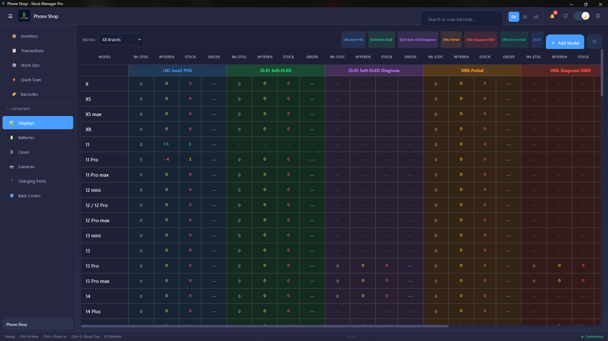
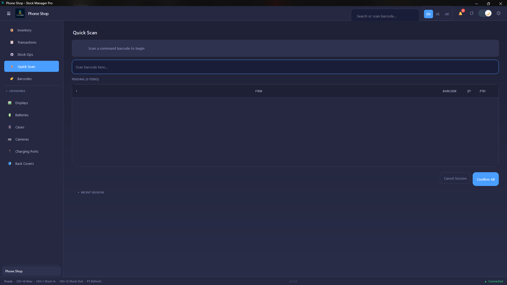
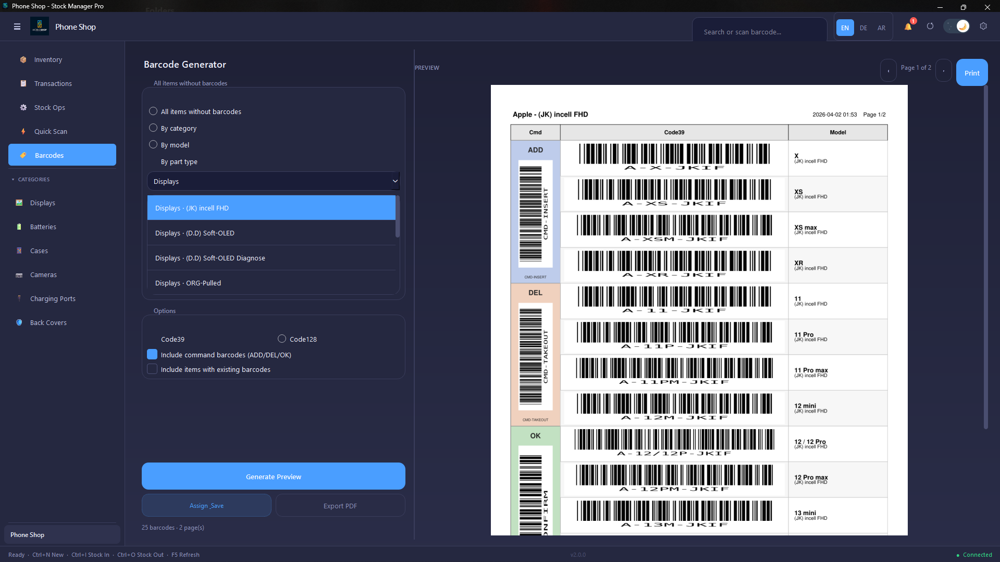

<div align="center">


# Stock Manager Pro

**Professional desktop inventory management for Windows**

Built with Python 3.11 · PyQt6 · SQLite · Offline-first · Optional cloud sync · Multilingual

[](https://python.org)
[](https://riverbankcomputing.com/software/pyqt/)
[](https://sqlite.org)
[](LICENSE)
[](https://github.com/AbdullahBakir97/Stock-manager/releases)
[](https://github.com/AbdullahBakir97/Stock-manager/releases)

[Features](#-features) · [Screenshots](#-screenshots) · [Installation](#-installation) · [Architecture](#-architecture) · [Project Structure](#-project-structure) · [Contributing](#-contributing)

</div>

---

## Overview

Stock Manager Pro is a professional, offline-first desktop inventory management application for small-to-medium repair shops, retail stores, and warehouses. It ships with a complete business operations suite — a full POS terminal, purchase-order lifecycle, stocktake audits, price lists, supplier CRM, multi-location stock, **IMEI-level phone-unit tracking**, and **14 branded PDF reports** — all built on a zero-freeze async engine with a clean controller architecture. Data stays local by default, with **optional multi-PC cloud sync** via Turso when you need it.

> **Designed for resale.** Every architecture decision prioritises reusability and extensibility so the codebase can serve as the foundation for a general-purpose stock management platform.

---

## ✨ Features

### Core Inventory
- Unified inventory across categories, part types, phone models, and colour variants
- **Matrix grid view** — spreadsheet-style bulk stock across model × part-type × colour, with a frozen model column, sticky headers, and per-part-type value totals
- **Phone units (IMEI tracking)** — track whole devices individually by IMEI: storage, condition, battery %, buy/sell price, status (in stock / sold / reserved), barcode labels, sold-history and a full audit log *(optional white-label module)*
- Stock In / Out / Adjust with timestamped notes and full undo / redo
- Per-item minimum-stock thresholds with real-time low-stock alerts
- Product photos, expiry dates, and warranty tracking per item
- Barcode generation (Code128/EAN) and USB scanner interception

### Business Modules
| Module | Highlights |
|---|---|
| **Sales / POS** | Cart-based POS, customer lookup, discounts, PDF receipts, edit/void with automatic stock reversal |
| **Phones (IMEI)** | Whole-device inventory by IMEI — brand × model stock grid, scan-to-sell, reserve, barcode labels, sold history |
| **Purchase Orders** | DRAFT → SENT → PARTIAL → RECEIVED lifecycle, auto stock-in on receipt |
| **Returns** | RESTOCK or WRITE_OFF actions, refund tracking, sale linkage |
| **Suppliers** | Supplier CRM, cost prices, lead days, linked inventory items |
| **Price Lists** | Create, draft, activate and bulk-apply pricing configurations |
| **Audit / Stocktake** | Cycle-based counted vs system qty comparison with variance reporting |
| **Customers** | Customer profiles linked to sales and purchase history |
| **Locations** | Multi-location stock with transfers between warehouse positions |
| **Reports** | 14 branded PDF reports — inventory, valuation (at cost), low stock, transactions, sales, category performance, audit, **phone inventory & sold history**, barcode labels, and more |

### Platform
- **Zero-freeze UI** — every DB operation runs off the main thread via `WorkerPool`
- **Optional cloud sync** — share one live dataset across multiple PCs via Turso (libSQL) over the HTTP API; pure-stdlib client, no server to run, opt-in per install
- **White-label modules** — shop-specific features (e.g. the Phones / IMEI tracker) are opt-in per install via Shop Settings → Modules
- **Multilingual** — English, German (DE), Arabic (AR) with live switching and full RTL layout
- **Four themes** — Dark, Light, Pro Dark (emerald/charcoal), Pro Light (emerald/white) — toggle updates all components
- **Excel-like zoom** — Ctrl+Scroll / Ctrl+Plus/Minus zoom (50–200%) with footer slider
- **Auto-updater** — manifest-based version check with SHA256 verification; CI/CD auto-release
- **Auto-backup** — scheduled backup with configurable retention
- **Optimised database** — thread-local connection pool, batch inserts, performance indexes, tuned pragmas
- **Undo / redo** — reverse any stock or phone-status operation
- **Tested & CI-released** — pytest suite over repositories, services and the full migration chain
- **Offline-first** — local SQLite (WAL), no telemetry; cloud sync is strictly opt-in

---

## 📸 Screenshots

> Screenshots use a demo **Galaxy@Phone** dataset.

### Analytics Dashboard
Real-time KPI cards (stock value at cost, revenue, transactions, low stock), a stock-health donut, value-by-brand bars, and a brand × part-type valuation pivot — all loaded asynchronously off the UI thread.


---

### Matrix View
The core workflow — spreadsheet-style bulk stock across model × part-type × colour, with a frozen model column, per-part-type value totals, and Low / Out / Reorder filters.



---

### Inventory
Searchable, filterable product table with KPI overview cards (units, low / out of stock, inventory value), status badges, and inline +1 / −1 quick-stock actions.


---

### Phones — IMEI tracking
Whole-device inventory tracked by IMEI: a brand × model stock grid by storage, KPIs (total / in stock / sold / avg battery / stock value), scan-to-sell, reserve, and barcode labels. *(Optional white-label module.)*


---

### Sales & POS
Cart-based point-of-sale with product picker, customer lookup, discounts, automatic PDF receipts, and edit / void with stock reversal.


---

### Reports
14 professional, branded PDF reports for **parts and phones** — inventory, valuation (at cost), low stock, transactions, sales, category performance, audit sheets, phone inventory & sold history, expiring stock, and barcode labels.


---

### Transactions
Paginated stock-movement audit log with an IN / OUT / ADJUST / Net summary strip, debounced filters, and Load-More pagination.


---

### Purchase Orders
Full PO lifecycle from DRAFT through SENT → PARTIAL → RECEIVED. Receiving a PO automatically triggers a stock-in.


---

### Suppliers
Supplier CRM with contact details, rating, linked inventory items, and open purchase-order count per supplier.


---

### Audit & Stocktake
Cycle-based stocktake with item-by-item counted-qty entry, system-vs-counted variance reporting, and a completion summary.


---

### Price Lists
Create and manage pricing configurations; apply a bulk percentage markup or push a list straight to live inventory.


---

### Returns
Process returns with RESTOCK or WRITE_OFF actions — reverses the original transaction and records the refund amount.


---

### Quick Scan
USB barcode-scanner interception with command barcodes (TAKEOUT / INSERT / CONFIRM) for hands-free stock counting.



---

### Barcode Generator
Generate and export Code128 / EAN barcodes; batch-print labels for new stock.



---

## 🖥️ System Requirements

| | |
|---|---|
| **OS** | Windows 10 or Windows 11 (64-bit) |
| **RAM** | 512 MB minimum · 2 GB recommended |
| **Disk** | 250 MB application + database storage |
| **Python** | 3.11+ (development only) |
| **Admin rights** | Not required |

---

## 📦 Installation

### Option A — Pre-built Executable (Recommended)

1. Download `StockManagerPro.zip` from the [latest release](https://github.com/AbdullahBakir97/Stock-manager/releases)
2. Extract to any folder (e.g. `C:\Apps\StockManagerPro\`)
3. Run `StockManagerPro.exe`

Data is stored at `%LOCALAPPDATA%\StockPro\StockManagerPro\stock_manager.db` — no installation wizard, no admin rights needed.

### Option B — Run from Source

**Prerequisites:** Python 3.11+, Git, Windows 10/11

```bash
git clone https://github.com/AbdullahBakir97/Stock-manager.git
cd Stock-manager

python -m venv venv
venv\Scripts\activate

pip install -r requirements.txt

cd src/files
python main.py
```

---

## 🚀 Quick Start

| Task | How |
|---|---|
| First-time setup | Complete the Setup Wizard on first launch |
| Add a product | `Ctrl+N` or **+ Add Product** button |
| Stock In | Select product → `Ctrl+I` |
| Stock Out | Select product → `Ctrl+O` |
| Adjust stock | Select product → `Ctrl+J` |
| Open POS | Navigate to **Sales / POS** → New Sale |
| Generate barcode | Right-click product → Generate Barcode or `Ctrl+B` |
| Export PDF report | Navigate to **Reports** or `Ctrl+P` |
| Admin settings | `Ctrl+Alt+A` or the ⚙ header icon |
| Switch language | Header language switcher (EN / DE / AR) |
| Undo last operation | Right-click transaction → Undo |
| Force refresh | `F5` |

---

## 🔨 Build Instructions

```bash
cd Stock-manager
pyinstaller src/StockManagerPro.spec --noconfirm
# Output: src/dist/StockManagerPro/StockManagerPro.exe
```

Build time ~3–5 minutes. Output ~180 MB (includes Python runtime, PyQt6, all dependencies).

---

## 🏗️ Architecture

### Layer Structure

```
┌──────────────────────────────────────────────────────────────┐
│  UI Layer  —  app/ui/                                        │
│  pages/ · components/ · dialogs/ · tabs/ · controllers/     │
├──────────────────────────────────────────────────────────────┤
│  Async Engine  —  app/ui/workers/                            │
│  WorkerPool · DataWorker · UpdateWorker                      │
├──────────────────────────────────────────────────────────────┤
│  Service Layer  —  app/services/                             │
│  StockService · SaleService · AuditService · …  (21 total)  │
├──────────────────────────────────────────────────────────────┤
│  Repository Layer  —  app/repositories/                      │
│  ItemRepo · SaleRepo · AuditRepo · …  (13 total)            │
├──────────────────────────────────────────────────────────────┤
│  Model Layer  —  app/models/                                 │
│  InventoryItem · Sale · PurchaseOrder · …  (13 total)       │
├──────────────────────────────────────────────────────────────┤
│  Core Layer  —  app/core/                                    │
│  Database · Theme · i18n · Config · Logger · Colors         │
│  SQLite WAL · Schema V23 · 27 tables · optional Turso sync  │
└──────────────────────────────────────────────────────────────┘
```

### Zero-Freeze Async Engine

The `WorkerPool` singleton (backed by `QThreadPool`) routes every DB operation off the main thread. The main thread only ever applies results — it never queries:

```python
# Background fetch → main-thread apply, keyed and cancellable
POOL.submit("analytics_refresh", self._fetch_all_data, self._apply_all_data)

# Debounced for filter inputs — cancels previous if fired again within delay
POOL.submit_debounced("txn_filter", self.fetch_filtered, self.load_results, delay_ms=100)

# Theme changes deferred to next event-loop tick — eliminates freeze on toggle
QTimer.singleShot(0, lambda: self._apply_ss(root, stylesheet))
```

### Controller Pattern

`main_window.py` was decomposed from 2,263 lines to 572 by extracting seven purpose-built controllers:

| Controller | Responsibility |
|---|---|
| `NavController` | Registry-based page navigation, sidebar toggle, matrix tab lifecycle |
| `StartupController` | Two-phase async startup — KPIs first, inventory table second |
| `UpdateController` | Manifest-based version check, update badge wiring |
| `AlertController` | Low-stock alert counts, notification panel refresh |
| `StockOpsController` | IN / OUT / ADJUST dispatch, dialog lifecycle |
| `BulkOpsController` | Bulk edit, bulk price change |
| `InventoryOpsController` | Inventory filter, selection, detail bar sync |

### Database — Schema V23

Full automatic migration chain from V1 through V23 runs on every startup:

| Migration | What was added |
|---|---|
| V3 | Shop config keys, `setup_complete` flag |
| V4 | Consolidate `products` + `stock_entries` → `inventory_items` |
| V5 | Quick Scan command barcodes in `app_config` |
| V6 | `part_type_colors`; UNIQUE(model, part_type, color) constraint; drop all legacy tables |
| V7 | `image_path` column on `inventory_items` |
| V8 | `expiry_date`, `warranty_date`; `locations`, `location_stock`, `stock_transfers` |
| V9 | `sales`, `sale_items` tables |
| V10 | `customers` table; `customer_id` FK on `sales` |
| V11 | `purchase_orders`, `purchase_order_lines`, `returns` |
| V12 | `suppliers` with rating; `supplier_items`; `inventory_audits`; `audit_lines`; `price_lists`; `price_list_items` |
| V13 | `model_part_type_colors` — per-model product colour overrides |
| V14 | Performance indexes on `inventory_items` (active, stock, model+pt, model+pt+color) |
| V15 | `part_types.default_price`; `scan_invoices`, `scan_invoice_items` (Quick Scan invoice history) |
| V16 | `cost_price` on `inventory_items` (cost-basis valuation) |
| V18 | Hot-path indexes (`phone_models.brand`, `part_type_colors`, `model_part_type_colors`) |
| V19–V21 | Barcode round-trip fixes for German (QWERTZ) keyboards (`+`→`P`, `Y`↔`Z`, `/`→`-`) with data migrations |
| V22 | `phones` — IMEI-tracked phone units |
| V23 | `phone_transactions` — phone-unit audit log |

**27 tables total:** `app_config`, `categories`, `part_types`, `phone_models`, `part_type_colors`, `model_part_type_colors`, `inventory_items`, `inventory_transactions`, `suppliers`, `supplier_items`, `locations`, `location_stock`, `stock_transfers`, `customers`, `sales`, `sale_items`, `purchase_orders`, `purchase_order_lines`, `returns`, `inventory_audits`, `audit_lines`, `price_lists`, `price_list_items`, `scan_invoices`, `scan_invoice_items`, `phones`, `phone_transactions`

---

## 📁 Project Structure

```
Stock-manager/
└── src/
    ├── StockManagerPro.spec              # PyInstaller build config
    ├── README.md
    └── files/
        ├── main.py                       # Entry point
        ├── requirements.txt
        ├── app/
        │   ├── core/
        │   │   ├── database.py           # Schema V23, migrations V1→V23, Turso HTTP client
        │   │   ├── theme.py              # 4 themes, zero-freeze deferred apply
        │   │   ├── i18n.py               # EN / DE / AR translations
        │   │   ├── colors.py             # 24-colour PALETTE
        │   │   ├── version.py            # APP_VERSION, UPDATE_MANIFEST_URL
        │   │   ├── health.py             # DB health checks
        │   │   ├── logger.py             # Structured rotating logger
        │   │   ├── config.py             # App config key-value store
        │   │   ├── icon_utils.py         # SVG icon loader
        │   │   └── scan_config.py        # Barcode scanner configuration
        │   │
        │   ├── models/                   # 13 domain dataclasses
        │   │   ├── item.py               # InventoryItem (core model)
        │   │   ├── transaction.py        # StockTransaction
        │   │   ├── sale.py               # Sale, SaleItem
        │   │   ├── purchase_order.py     # PurchaseOrder, POLineItem
        │   │   ├── return_item.py        # Return, ReturnAction
        │   │   ├── supplier.py           # Supplier
        │   │   ├── customer.py           # Customer
        │   │   ├── audit.py              # AuditCycle, AuditLine
        │   │   ├── price_list.py         # PriceList, PriceListItem
        │   │   ├── location.py           # Location, LocationStock
        │   │   ├── category.py           # Category
        │   │   ├── phone_model.py        # PhoneModel
        │   │   └── scan_session.py       # ScanSession
        │   │
        │   ├── repositories/             # 13 SQL-only data access repos
        │   │   ├── item_repo.py
        │   │   ├── transaction_repo.py
        │   │   ├── sale_repo.py
        │   │   ├── purchase_order_repo.py
        │   │   ├── return_repo.py
        │   │   ├── supplier_repo.py
        │   │   ├── customer_repo.py
        │   │   ├── audit_repo.py
        │   │   ├── price_list_repo.py
        │   │   ├── location_repo.py
        │   │   ├── category_repo.py
        │   │   ├── model_repo.py
        │   │   └── base.py
        │   │
        │   ├── services/                 # 21 business-logic services
        │   │   ├── stock_service.py      # IN / OUT / ADJUST / undo
        │   │   ├── alert_service.py      # StockAlertCounts
        │   │   ├── sale_service.py       # Cart checkout, deduction
        │   │   ├── receipt_service.py    # PDF receipt via fpdf2
        │   │   ├── purchase_order_service.py
        │   │   ├── return_service.py
        │   │   ├── supplier_service.py
        │   │   ├── customer_service.py
        │   │   ├── audit_service.py
        │   │   ├── price_list_service.py # apply_price_list() bulk update
        │   │   ├── location_service.py
        │   │   ├── undo_service.py       # Reverse last transaction
        │   │   ├── backup_service.py     # Retention-managed backup
        │   │   ├── backup_scheduler.py   # 5-min QTimer off main thread
        │   │   ├── update_service.py     # Manifest check + download
        │   │   ├── image_service.py      # Product photo import/resize
        │   │   ├── export_service.py     # CSV / JSON export
        │   │   ├── import_service.py     # CSV import + validation
        │   │   ├── report_service.py     # PDF reports
        │   │   ├── barcode_gen_service.py
        │   │   └── scan_session_service.py
        │   │
        │   └── ui/
        │       ├── main_window.py        # 572 lines (was 2,263)
        │       ├── helpers.py
        │       ├── delegates.py
        │       │
        │       ├── workers/              # Async engine
        │       │   ├── worker_pool.py    # POOL singleton, keyed cancellation
        │       │   ├── data_worker.py    # Generic background fetch
        │       │   └── update_worker.py  # Version-check worker
        │       │
        │       ├── controllers/          # 7 purpose-built controllers
        │       │   ├── nav_controller.py
        │       │   ├── startup_controller.py
        │       │   ├── update_controller.py
        │       │   ├── alert_controller.py
        │       │   ├── stock_ops.py
        │       │   ├── bulk_ops.py
        │       │   └── inventory_ops.py
        │       │
        │       ├── pages/                # 11 full-page views
        │       │   ├── inventory_page.py
        │       │   ├── transactions_page.py
        │       │   ├── analytics_page.py
        │       │   ├── sales_page.py
        │       │   ├── purchase_orders_page.py
        │       │   ├── returns_page.py
        │       │   ├── suppliers_page.py
        │       │   ├── price_lists_page.py
        │       │   ├── audit_page.py
        │       │   ├── reports_page.py
        │       │   └── barcode_gen_page.py
        │       │
        │       ├── components/           # 23 reusable UI components
        │       │   ├── dashboard_widget.py   # KPI summary cards
        │       │   ├── header_bar.py         # Glass search bar
        │       │   ├── footer_bar.py         # Status + filter hint
        │       │   ├── sidebar.py            # Nav button registry
        │       │   ├── theme_toggle.py       # Animated sun/moon toggle
        │       │   ├── language_switcher.py  # Animated dropdown
        │       │   ├── update_banner.py      # Slide-in update panel
        │       │   ├── notification_panel.py # Alert counts + badge
        │       │   ├── product_detail.py     # Product detail panel
        │       │   ├── product_detail_bar.py # Sparkline + quick actions
        │       │   ├── product_table.py      # Responsive columns
        │       │   ├── transaction_table.py
        │       │   ├── responsive_table.py
        │       │   ├── toast.py              # Floating notifications
        │       │   ├── loading_overlay.py
        │       │   ├── splash_screen.py      # Geometric cube + version badge
        │       │   ├── charts.py
        │       │   ├── empty_state.py
        │       │   ├── collapsible_section.py
        │       │   ├── mini_txn_list.py
        │       │   ├── barcode_line_edit.py
        │       │   ├── filter_bar.py
        │       │   └── matrix_widget.py      # Frozen col, zoom, per-model colors
        │       │
        │       ├── tabs/
        │       │   ├── matrix_tab.py
        │       │   ├── quick_scan_tab.py
        │       │   ├── stock_ops_tab.py
        │       │   └── base_tab.py
        │       │
        │       └── dialogs/
        │           ├── product_dialogs.py       # ModernDialog, ColorPicker, StockOp
        │           ├── dialog_base.py
        │           ├── bulk_price_dialog.py
        │           ├── price_list_dialogs.py
        │           ├── help_dialog.py
        │           ├── matrix_dialogs.py
        │           ├── barcode_assign_dialog.py
        │           ├── setup_wizard.py
        │           └── admin/                   # 14-panel admin dialog
        │               ├── admin_dialog.py
        │               ├── shop_settings_panel.py
        │               ├── categories_panel.py
        │               ├── part_types_panel.py
        │               ├── models_panel.py
        │               ├── scan_settings_panel.py
        │               ├── backup_panel.py
        │               ├── import_export_panel.py
        │               ├── db_tools_panel.py
        │               ├── suppliers_panel.py
        │               ├── locations_panel.py
        │               ├── customers_panel.py
        │               ├── about_panel.py
        │               └── color_picker_widget.py
        │
        ├── tests/                        # 30+ pytest modules
        │   ├── conftest.py               # In-memory SQLite fixtures
        │   ├── test_database.py          # Schema creation
        │   ├── test_migration.py         # Full V1→V12 chain
        │   ├── test_item_repo.py
        │   ├── test_transaction_repo.py
        │   ├── test_stock_service.py
        │   ├── test_sale_service.py
        │   ├── test_audit_service.py
        │   ├── test_purchase_order_service.py
        │   ├── test_return_service.py
        │   ├── test_supplier_service.py
        │   ├── test_customer_service.py
        │   ├── test_price_list_service.py
        │   ├── test_backup_service.py
        │   ├── test_undo_service.py
        │   ├── test_export_service.py
        │   └── … (30+ total)
        │
        └── img/                          # Screenshots & assets
            ├── icon_cube.ico             # App icon (multi-resolution)
            ├── icon_cube.png             # 256px isometric cube
            ├── icon_cube_16.png
            ├── icon_cube_32.png
            ├── icon_cube_48.png
            ├── icon_cube_64.png
            ├── icon_cube_128.png
            ├── icon_cube_256.png
            ├── scr-dashboard.png
            ├── scr-inventory-v2.png
            ├── scr-sales.png
            ├── scr-analytics.png
            ├── scr-transactions.png
            ├── scr-purchase-orders.png
            ├── scr-audit.png
            ├── scr-price-lists.png
            ├── scr-suppliers.png
            ├── scr-returns.png
            ├── scr-admin.png
            ├── scr-admin-about.png
            ├── scr-displays.png
            ├── scr-quickscan.png
            ├── scr-barcode.png
            └── icons/
```

---

## 🛠️ Tech Stack

| Layer | Technology | Purpose |
|---|---|---|
| UI Framework | **PyQt6 6.10** | Cross-platform desktop GUI |
| Database | **SQLite 3** WAL + FK | Local relational storage |
| PDF | **fpdf2 2.8** + **PyMuPDF 1.27** | Reports and receipts |
| Barcodes | **python-barcode 0.16** | Code128 / EAN generation |
| Images | **Pillow 12.1** | Product photos, icon handling |
| Packaging | **PyInstaller 6.19** | Windows executable |
| Testing | **pytest** | 30+ modules, in-memory fixtures |

```
PyQt6==6.10.2
Pillow==12.1.1
fpdf2==2.8.7
PyMuPDF==1.27.2.2
python-barcode==0.16.1
defusedxml==0.7.1
PyInstaller==6.19.0
```

---

## ⌨️ Keyboard Shortcuts

| Action | Shortcut |
|---|---|
| New product | `Ctrl+N` |
| Stock In | `Ctrl+I` |
| Stock Out | `Ctrl+O` |
| Adjust stock | `Ctrl+J` |
| Search | `Ctrl+F` |
| Delete product | `Del` |
| Generate barcode | `Ctrl+B` |
| Export PDF report | `Ctrl+P` |
| Zoom in | `Ctrl+=` or `Ctrl+Scroll Up` |
| Zoom out | `Ctrl+-` or `Ctrl+Scroll Down` |
| Reset zoom | `Ctrl+0` |
| Admin settings | `Ctrl+Alt+A` |
| Force refresh | `F5` |

---

## 🧪 Running Tests

```bash
cd src/files
pytest tests/ -v

# With coverage
pytest tests/ --cov=app --cov-report=term-missing

# Single suite
pytest tests/test_stock_service.py -v
```

All tests use an in-memory SQLite database with the full V12 schema applied — no file system side effects.

---

## 👨‍💼 Admin Panel Guide

Access: `Ctrl+Alt+A` · or the ⚙ icon in the header bar

| Panel | Purpose |
|---|---|
| **Shop Settings** | Name, address, phone, email, currency, tax rate, admin PIN, language |
| **Categories** | Create, edit, reorder inventory categories |
| **Part Types** | Product type classifications with colour assignments |
| **Models** | Device models and variants within categories |
| **Scan Settings** | Scanner input delay, command barcode values, duplicate handling |
| **Backup** | Manual backup trigger, retention-managed backup list |
| **Import / Export** | CSV / JSON import and export per entity type |
| **DB Tools** | VACUUM, integrity check, schema version display |
| **Suppliers** | Supplier CRUD in admin context |
| **Locations** | Warehouse bin / shelf location management |
| **Customers** | Customer profile management |
| **About** | App version, schema V23, DB size, OS info, update check |

---

## 📱 Barcode Workflow

**Scanning:** Plug in any USB HID scanner → scan a product barcode → stock operation dispatches automatically via the Quick Scan tab.

**Generation:** Select product → `Ctrl+B` → configure format and size → export PNG or print directly.

**Command barcodes:** Print `CMD-TAKEOUT`, `CMD-INSERT`, and `CMD-CONFIRM` barcodes to control the Quick Scan workflow hands-free. Values are configurable in Admin → Scan Settings.

---

## 🔒 Data & Privacy

All data stays on your machine:

```
%LOCALAPPDATA%\StockPro\StockManagerPro\stock_manager.db
```

- No internet connection required (update check is opt-in)
- No telemetry, no user tracking; cloud sync is strictly opt-in (your own Turso database)
- Complete audit log of every stock movement
- Automatic backup every 5 minutes with configurable retention
- SQLite WAL mode for crash safety

**Logs:**
```
%LOCALAPPDATA%\StockPro\StockManagerPro\logs\
```

---

## 🤝 Contributing

```bash
git clone https://github.com/AbdullahBakir97/Stock-manager.git
cd Stock-manager
git checkout dev
git checkout -b feature/your-feature-name

python -m venv venv && venv\Scripts\activate
pip install -r requirements.txt

# Run app
cd src/files && python main.py

# Run tests
pytest tests/ -v
```

**Layer rules (strictly enforced):**
- UI never imports repositories directly — always go through services
- Services never import UI — they return data or raise exceptions
- Repositories contain only SQL and data mapping — no business logic
- Models are pure dataclasses — no DB access, no side effects

**Adding a new feature:**
1. Model → `app/models/`
2. Migration → `app/core/database.py` (V14+)
3. Repository → `app/repositories/`
4. Service → `app/services/`
5. UI → `app/ui/pages/` or `app/ui/dialogs/`
6. Translations → `app/core/i18n.py` (EN + DE + AR)
7. Wire into `main_window.py` via the appropriate controller
8. Tag + push → GitHub Actions builds, signs, and releases automatically

---

## 🐛 Troubleshooting

**Application won't start**
Delete `%LOCALAPPDATA%\StockPro\` to reset all data and config to defaults. Check that Windows Defender isn't blocking the executable.

**Barcode scanner not recognised**
Verify the scanner is in Keyboard Emulation (HID) mode. Test in Notepad first. Adjust input delay in Admin → Scan Settings.

**Database errors**
Run VACUUM and integrity check in Admin → DB Tools. Restore from a recent backup if needed (Admin → Backup).

**Performance**
The async engine ensures the UI never blocks regardless of database size. If you see main-thread freezes please [open an issue](https://github.com/AbdullahBakir97/Stock-manager/issues) with your schema version and OS details.

---

## 📈 Releases

**Current release: v2.6.1** · [Full changelog →](CHANGELOG.md)

Every release is built, signed, and published automatically by CI (`.github/workflows/release.yml`) on each `v*.*.*` tag — stamping the version across `version.py`, the installer files, this README, and `update_manifest.json`. The complete, per-version history lives in **[CHANGELOG.md](CHANGELOG.md)**.

| Milestone | Highlights |
|---|---|
| **2.6.0** | Cloud-sync enable fix, dashboard stock-health accuracy, refreshed README + screenshots |
| **2.5.x** | 📱 Phones (IMEI) module, optional cloud sync (Turso), 14 professional PDF reports, German-keyboard barcode round-trip fixes |
| **2.3.x** | Zero-freeze async engine, controller refactor, full business suite (POS, Purchase Orders, Returns, Suppliers, Audit, Price Lists, Customers, Locations) |
| **2.1 – 2.2** | Colour dimension in the matrix, barcode generator, Quick Scan workflow |
| **1.0.0** | Core inventory, barcode scanning, multilingual interface, offline SQLite |

---

## 📄 License

MIT License — see [LICENSE](LICENSE) for details.

Copyright © 2026 Abdullah Bakir

---

<div align="center">

**[GitHub Repository](https://github.com/AbdullahBakir97/Stock-manager)** · **[Report a Bug](https://github.com/AbdullahBakir97/Stock-manager/issues)** · **[Request a Feature](https://github.com/AbdullahBakir97/Stock-manager/discussions)**

Happy Inventory Managing 🚀

</div>
