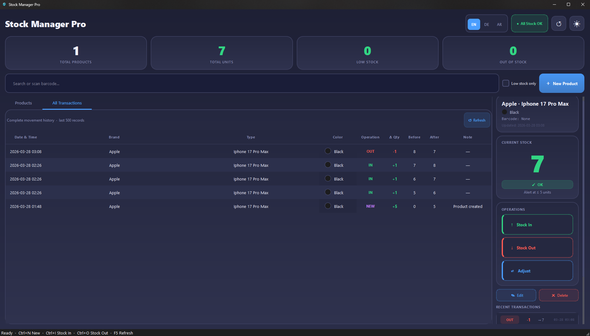
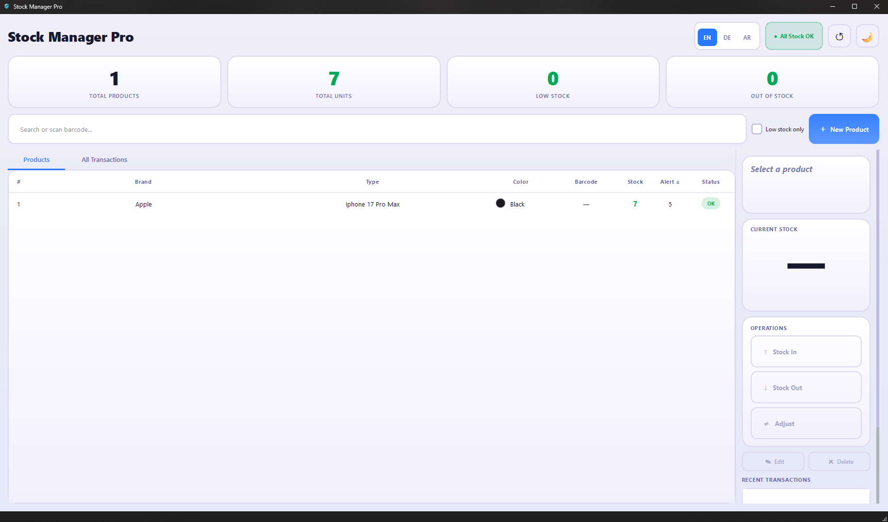
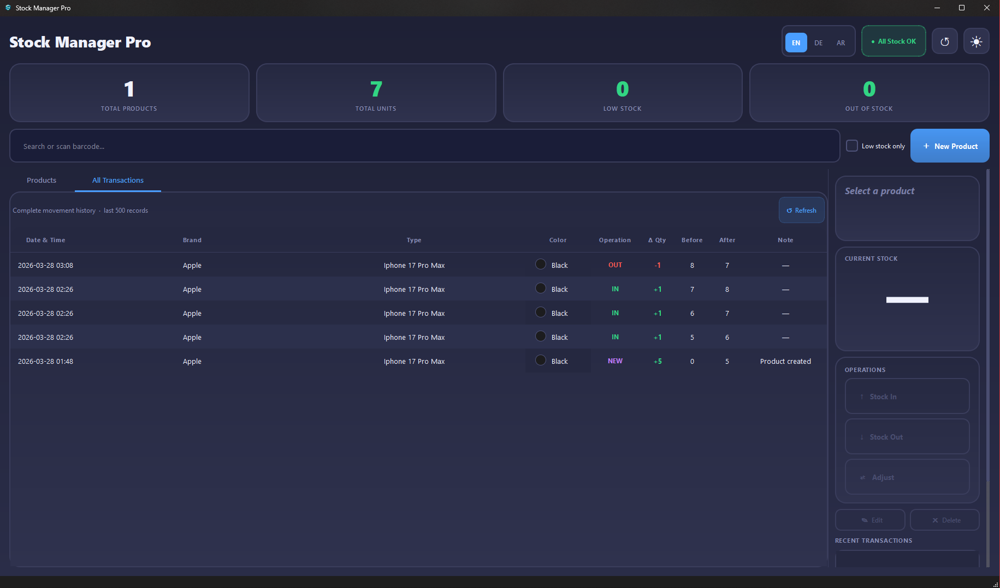
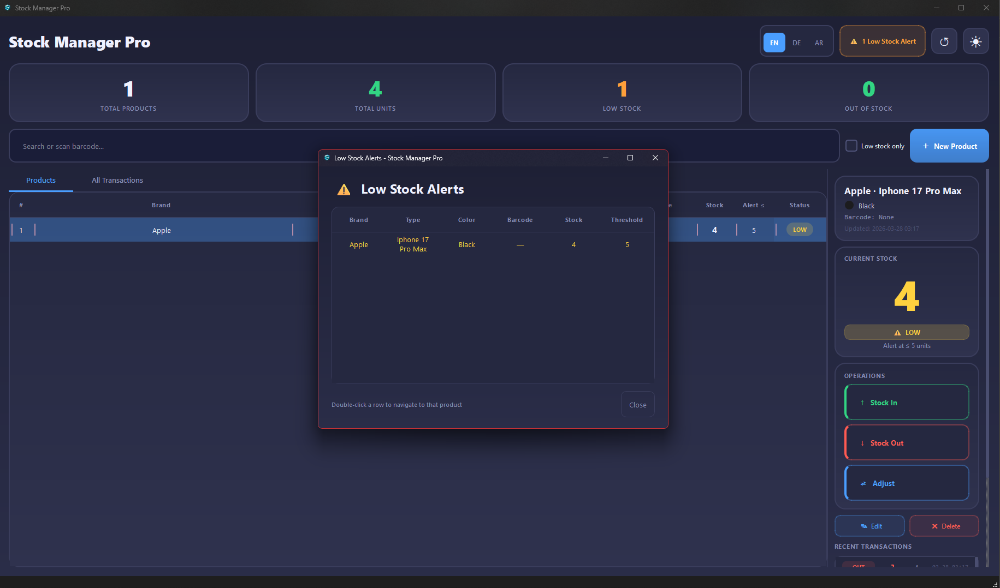

<p align="center">
  
</p>

<h1 align="center">Stock Manager Pro</h1>

<p align="center">
  A professional desktop inventory management application for Windows.<br/>
  Built with Python and PyQt6 — fast, offline, and multilingual.
</p>

<p align="center">
  
  
  
  
  
</p>

---

## Features

- **Full inventory management** — add, edit, delete products with brand, type, color, and barcode
- **Stock operations** — Stock In, Stock Out, and manual Adjust with notes and full history
- **Barcode scanner support** — plug in any USB scanner; input is intercepted automatically
- **Low stock alerts** — configurable threshold per product, highlighted in the dashboard
- **Transaction history** — complete audit log of every stock movement
- **Multilingual** — English, German (DE), Arabic (AR) with live switching and RTL layout
- **Offline & private** — all data stored locally in SQLite, no internet required

---

## Screenshots



| Dashboard | Stock Operation | Low Stock Alerts |
|-----------|----------------|-----------------|
| | |  |

---

## Installation

### Option A — Pre-built (recommended)

1. Download `StockManagerPro.zip` from the [latest release](../../releases/latest)
2. Extract the zip anywhere (e.g. `C:\Apps\StockManagerPro\`)
3. Run `StockManagerPro.exe`

> No installation required. No admin rights needed. Data is stored in `%LOCALAPPDATA%\StockPro\StockManagerPro\`.

### Option B — Run from source

**Requirements:** Python 3.11+, Windows 10/11

```bash
git clone https://github.com/YOUR_USERNAME/stock-manager.git
cd stock-manager

python -m venv venv
venv\Scripts\activate

pip install PyQt6 Pillow

cd src/files
python main.py
```

---

## Building

### . Build the executable

```bash
# From the project root
pyinstaller StockManagerPro.spec --noconfirm
```

Output: `dist/StockManagerPro/StockManagerPro.exe`


## Project Structure

```
stock-manager/
├── src/
│   ├── files/
│   │   ├── main.py          # Entry point
│   │   ├── main_window.py   # Main UI (table, detail panel, toolbar)
│   │   ├── dialogs.py       # All modal dialogs
│   │   ├── database.py      # SQLite layer
│   │   ├── theme.py         # Qt stylesheet & design tokens
│   │   ├── colors.py        # Product color palette
│   │   ├── i18n.py          # Translations (EN / DE / AR)
│   │   └── img/             # App icons
│   └── StockManagerPro.spec # PyInstaller build spec
└── .gitignore
```

---

## Tech Stack

| Layer | Technology |
|-------|-----------|
| UI Framework | [PyQt6](https://www.riverbankcomputing.com/software/pyqt/) |
| Database | SQLite 3 (via Python stdlib) |
| Packaging | [PyInstaller](https://pyinstaller.org/) |

---

## Keyboard Shortcuts

| Action | Shortcut |
|--------|----------|
| New product | `Ctrl+N` |
| Stock In | `Ctrl+I` |
| Stock Out | `Ctrl+O` |
| Search | `Ctrl+F` |
| Delete product | `Del` |

---

## Data & Privacy

All data is stored **locally** on your machine at:

```
%LOCALAPPDATA%\StockPro\StockManagerPro\stock_manager.db
```

No telemetry, no cloud sync, no internet connection required.

---

## License

MIT License — see [LICENSE](LICENSE) for details.
